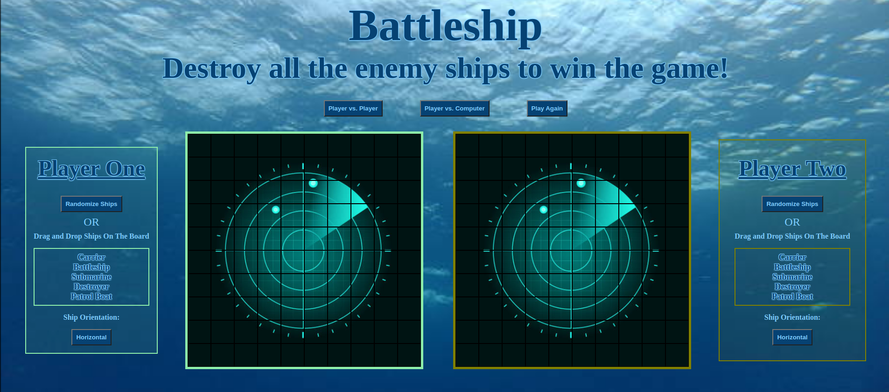
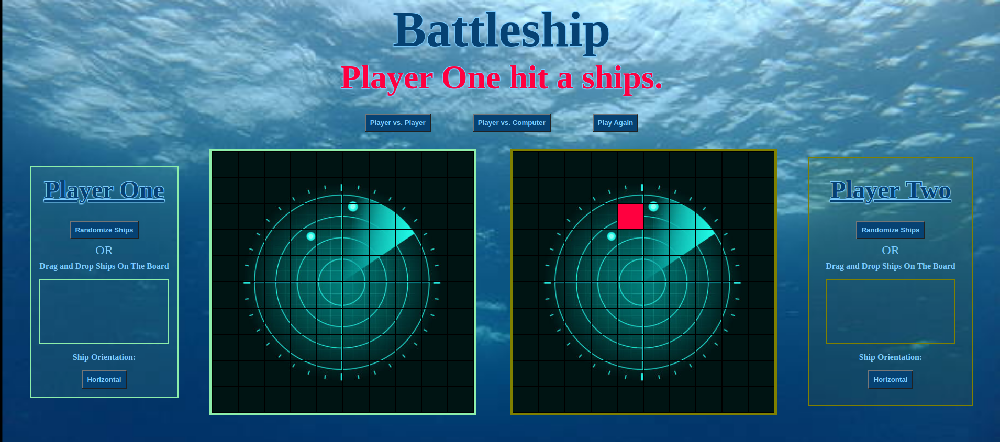
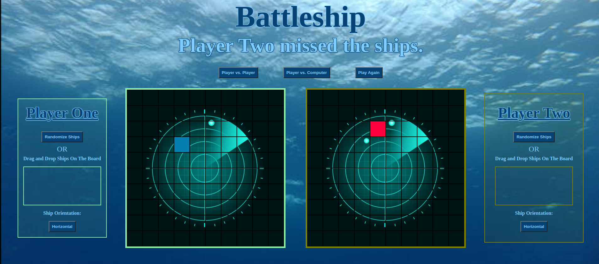
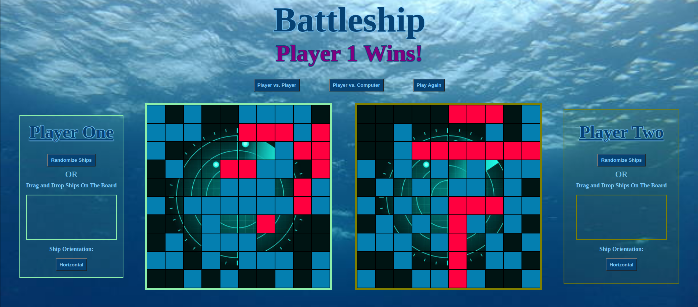

# Battleship

This Battleship game was created using JavaScript, HTML, CSS, webpack, ESLin, and JSON. I used some Test Driven Development (TDD) during this project also. The Battleship game can be played with two players or one player against the computer.

***Project Images***

Game Start:

Ship Hit:

Ship Missed:

Winner:

***Features***

1. The game has two play modes. The user will click the button for the mode they choose.

    a. Player vs. Player

    b. Player vs. Computer

2. The game has a play again button which will clear the current game data and start a new game.

3. The player can put ships on their board two ways.

    a. The Randomize Ships button. This will randomly shuffle the ships vertical and horizontal so they are not all the same direction.

    b. Dragging the ships from the ships' container to the board while dropping the ships where the player chooses.

    c. The Player vs. Computer mode will place the ships randomly on the second board. The computer will go second.

    d. The player can also choose the orientation of their ship to be vertical or horizontal by using the ship orientation button. The user can switch back and forth during ship placement if they choose.

4. Board effects:

    a. The board will show where the ship is hovered and how many tiles will be used on the drop.

    b. When the ships are dropped they will show a different color from the hovered color effect. The dropped ship will dissapear after a short time so the other board's ships can be placed.

    c.Ships cannot overlap, the ship that is trying to overlap will be diverted to the nearest available space. The user will see where their ship will drop if they release it by viewing the hover color effect.

    d. Ships will stay on the board. If a ship is trying to be placed where it would wrap to a new row or column it will be diverted with an offset.

5. The instructions display will changed based on the message needing to be delivered. Messages include:

    a. Initial Instructions: "Destroy all the enemy ships to win the game!" 

    b. Player moves misses the ship: "(Player (1 or 2) OR Computer) missed the ships."

    c. Player hits a ship: "(Player (1 or 2) OR Computer) hit a ship!"

    d. Winner is called: "(Player (1 or 2) OR Computer) Wins!"

    e. Error if move is made before both boards' ships are placed: "Place all ships on the boards before starting the game!"

Credits:

Sonar and Ocean Images: https://www.istockphoto.com/
